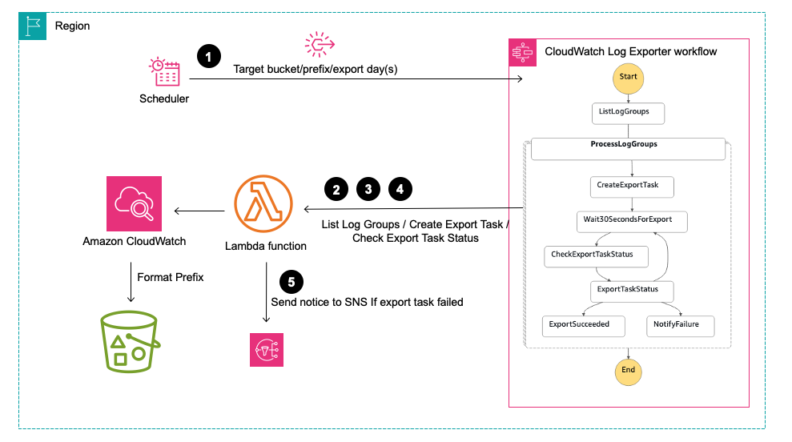

# 通过Step Functions和LAMBDA实现周期性归档cloudwatch log 到S3

---
## 背景
AWS Cloudwatch Log默认保存了多种AWS服务的日志信息，特别是托管服务的日志。默认情况下，Cloudwatch日志存储成本略高于标准对象存储的存储成本。

下面价格对比以美东一为例：


| Option                        |                                    Price                                    |
|:------------------------------|:---------------------------------------------------------------------------:|
| Cloudwatch Log Data Stored    | $0.03 per GB compressed (0.15 compression ratio for each uncompressed byte) |
| S3 Standard                   |                     $0.021 per GB (Over 500 TB / Month)                     |                              |                                                                             |
| S3 Glacier Flexible Retrieval |                               $0.0036 per GB                                |

多数情况下，一些不重要的日志可以通过Cloudwatch Log Retention Setting 定期清理历史日志。对于一些比较重要的日志，可以通过本方案进行对象存储归档。

Cloudwatch Log支持[ExportTask](https://docs.aws.amazon.com/AmazonCloudWatchLogs/latest/APIReference/API_CreateExportTask.html)API，可以把Cloudwatch Log日志归档到对象存储。 但是这个API有一些限制：

* 异步调用，创建export任务后，需要用[DescribeExportTasks](https://docs.aws.amazon.com/AmazonCloudWatchLogs/latest/APIReference/API_DescribeExportTasks.html)API确认任务状态。
* 每个账号只支持一个ExportTask处于活跃状态（RUNNING or PENDING），这个限制不可更改。
* Cloudwatch Log只能导出到本region的对象存储

本方案用于指定Cloudwatch log 定期归档的场景。

## 应用架构



## 安装方式

```aws
./cdk-deploy-to.sh <accountID> <Region> 
```

## 使用方式

### 一次性执行
通过向Step Functions的State machines传入指定参数启动execution。

例如：

```aws
{
  "regionBucketMap": {
    "us-east-1": "s3://my-bucket-us-east-1",
    "ap-southeast-1": "s3://my-bucket-ap-southeast-1"
  },
  "exportDays": 1,
  "snsTopicArn": "<arn of sns topic>",
  "exportlogPrefix": "cloudwatch-logs-archive"
}
```

上面参数会把美东一的日志备份到s3://my-bucket-us-east-1桶中，把新加坡的日志备份到s3://my-bucket-ap-southeast-1桶中。

日志保存的格式如下：

```aws
exportlogPrefix/logGroupName/year=%d/month=%02d/day=%02d"
```

### 定时执行

编辑CDK自动创建的EventBridge Rule， 在Additional settings中，选择Constant（JSON text)，然后指定下面内容：

```aws
{
  "regionBucketMap": {
    "us-east-1": "s3://zzhe-iad-2",
    "ap-southeast-1": "s3://zzhe-sin-1"
  },
  "exportDays": 1,
  "snsTopicArn": "arn:aws:sns:ap-northeast-1:894855526703:cloudwatch-log-export-failures",
  "exportlogPrefix": "cloudwatch-logs"
}
```

如果EventBridge Rule是每天执行，则设置exportDays=1； 如果EventBridge Rule是每周定期执行，则需要设置exportDays=7。

## 权限

CDK会以最小权限模式创建lambda role。 日志归档的目标桶需要满足[文档](https://docs.aws.amazon.com/AmazonCloudWatch/latest/logs/S3ExportTasksConsole.html)中的权限要求。

